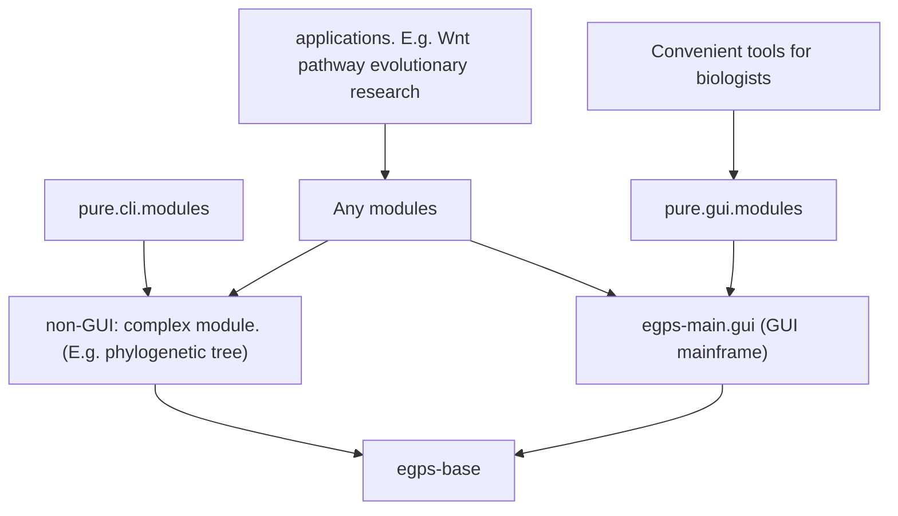

# egps-base

The core infrastructure of the eGPS2 project. See the `docs` subdirectory for complete class documentation.

[中文版 README](README_zh.md)


## About this project

Please see https://www.yuque.com/u21499046/egpsdoc for all documentation.

The class annotations are available in the `/docs` directory.


## Module Relationship

From eGPS 1.0 -> eGPS 2.0 -> eGPS 2.1, we have changed the technical architecture.



This is the `egps-base` project.

Note: The `egps-main.gui` module is **NOT open sourced**, but it can be freely used.

The diagram above is a classic directed acyclic graph (DAG) of module dependencies:

1. At the top is an application project that depends on `eGPS2.1`, such as a research project in evolutionary biology.
2. `egps-base` is a foundational utility library with no dependencies.
3. `egps-main.gui` represents the entire eGPS framework and includes the VOICE framework.
4. `non-gui complex modules` refer to large-scale, non-utility modules.
5. `Convenient tools for biologists` are handy, user-friendly tools designed specifically for researchers.


# How to run this project

Direct `clone` this repo and import into `IDEA`.

We use `Java 25`.


## How to deploy

Export all dependency JAR files:

```bash
mvn dependency:copy-dependencies -DoutputDirectory=/Users/dalang/Documents/software/egps-collection/deployed
```

Build and package the project (generates source and binary JARs):

```bash
mvn clean package source:jar
```

This will generate `target/egps-base-${version}-sources.jar` and `target/egps-base-${version}.jar`


# How to use

## On macOS

### GUI example
```bash
java -cp "dependency-egps/*" gui.simple.tools.FilePathNormalizedGUI
```


### Command-line example

To see all available command-line tools:
```bash
java -cp "target/classes:dependency-egps/*" cli.tools.ListTools
```
