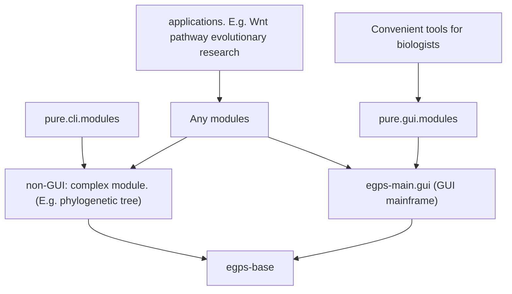

# egps-base

The core infrastructure of the eGPS2 project. See the `docs` subdirectory for complete class documentation.

[中文版 README](README_zh.md)


## About this project

Please see https://www.yuque.com/u21499046/egpsdoc for all documentation.

The class annotations are available in the `/docs` directory.


## Module Relationship

From eGPS 1.0 -> eGPS 2.0 -> eGPS 2.1, we have changed the technical architecture.



This is the `egps-base` project.

Note: The `egps-main.gui` module is **NOT open sourced**, but it can be freely used.

The diagram above is a classic directed acyclic graph (DAG) of module dependencies:

1. At the top is an application project that depends on `eGPS2.1`, such as a research project in evolutionary biology.
2. `egps-base` is a foundational utility library with no dependencies.
3. `egps-main.gui` represents the entire eGPS framework and includes the VOICE framework.
4. `non-gui complex modules` refer to large-scale, non-utility modules.
5. `Convenient tools for biologists` are handy, user-friendly tools designed specifically for researchers.


# How to run this project

Direct `clone` this repo and import into `IDEA`.

We use `Java 25`.


## How to deploy

Export all dependency JAR files:

```bash
mvn dependency:copy-dependencies -DoutputDirectory=/Users/dalang/Documents/software/egps-collection/deployed
```

Build and package the project (generates source and binary JARs):

```bash
mvn clean package source:jar
```

This will generate `target/egps-base-${version}-sources.jar` and `target/egps-base-${version}.jar`


# How to use

## On macOS

### GUI example
```bash
java -cp "dependency-egps/*" gui.simple.tools.FilePathNormalizedGUI
```


### Command-line example

To see all available command-line tools:
```bash
java -cp "../dependency-egps/*" cli.tools.ListTools
# output
# Current available programs are:
#1	cli.tools.ClipboardPath4Win2WSL	Convert Windows file paths from clipboard to WSL format (e.g., C:\Users\... → /mnt/c/Users/...) and paste back to clipboard.
#2	cli.tools.ClipboardPathNormalized	Normalize file paths from clipboard by converting all backslashes to forward slashes for cross-platform compatibility.
#3	cli.tools.CountFilesWithSuffix	Count the number of files in a directory that match a specific file extension (non-recursive).
#4	cli.tools.ListFilesWithSuffix	List all files in a directory with a specified suffix and optionally export the filenames to a TSV file for batch processing.
#5	cli.tools.CheckNwkFormat	Validate whether a file contains phylogenetic trees in valid Newick (NWK) format by attempting to parse each line.
#6	cli.tools.RemoveInternalNodeNames	Remove internal node names from phylogenetic trees in Newick format while preserving leaf names, branch lengths, and tree topology.
#7	cli.tools.NodeNames4Space4Underline	Replace all spaces in phylogenetic tree node names with underscores to ensure compatibility with phylogenetic analysis tools.
#8	fasta.comparison.FastaComparer	Compare two FASTA files using BLAST/Diamond alignment results (fmt6 format) to calculate sequence match coverage ratios.
#9	fasta.comparison.PairwiseSeqDiffPrinter	Visualize pairwise sequence alignment differences with customizable marking modes, showing matches or mismatches and identity percentage.
#10	fasta.stat.UniqueStat	Analyze FASTA file for duplicate sequences, reporting frequency counts and calculating the repeat ratio for quality control.
#11	fasta.stat.BatchUniqueStat	Batch process multiple FASTA files for duplicate sequence analysis, generating statistics for all files in a directory.
#12	cli.tools.SeeModulesWeHave	Display a comprehensive list of all available eGPS modules that implement the IModuleSignature interface with their descriptions.
java -cp "../dependency-egps/*" cli.tools.SeeModulesWeHave
```

Then you can see all modules.

# What functionalities are included?

This base module has been continuously developed over the author's six years of PhD and several years of postdoctoral research, containing many essential components. However, it's impossible to document everything here.

Since we have open-sourced all the code, you are welcome to read the source code directly - every class has comments.

I haven't generated Javadoc because Javadoc is not very useful for code users, and I believe Javadoc is very unfriendly for developers. Check the `docs` subdirectory for complete class documentation.
