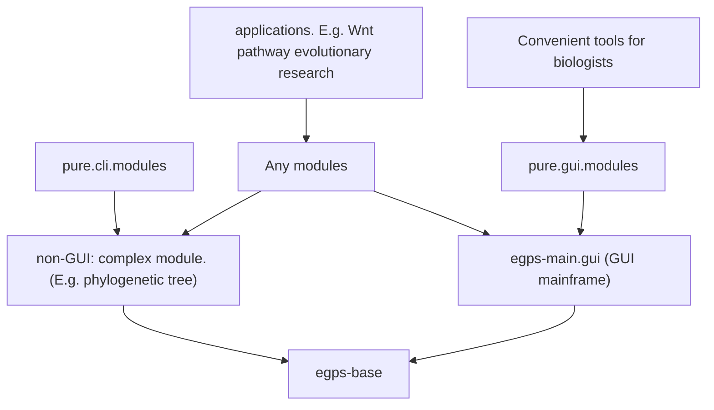

# egps-base

The core infrastructure of the eGPS2 project. See the `docs` subdirectory for complete source-level class documentation.

[中文版 README](README_zh.md)

## About this project

Full documentation is available at: https://www.yuque.com/u21499046/egpsdoc

See the `docs` subdirectory for complete source-level class documentation; this README only provides a technical summary.


## Module Relationships from a Technical Perspective

The technical architecture evolved from eGPS 1.0 to eGPS 2.0 and then to eGPS 2.1.


```mermaid
graph TD
      mainframe --> egps-base;
      pure.cli.modules --> bigM[non-GUI: complex module. E.g. phylogenetic tree];
      any.modules --> mainframe["egps-main.gui (GUI mainframe)"];
      pure.gui.modules --> mainframe["egps-main.gui (GUI mainframe)"];
      application[applications. E.g. Wnt pathway evolutionary research] --> any.modules[Any modules];
		bigM --> egps-base;
            any.modules --> bigM["non-GUI: complex module. (E.g. phylogenetic tree)"];
            help.modules["Convenient tools for biologists"] --> pure.gui.modules

```

This repository is the low-level `egps-base` project.

Note: The `egps-main.gui` module is **NOT open sourced**, but it can be freely used.

The diagram above is a classic directed acyclic graph (DAG) of module dependencies:

1. At the top is an application project that depends on `eGPS2.1`, for example an evolutionary biology study such as Wnt pathway evolution research.
2. `egps-base` sits at the bottom of the stack and provides foundational utility functionality.
3. `egps-main.gui` is the main eGPS framework and includes the VOICE framework.
4. `non-GUI complex modules` are larger non-utility modules, mainly focused on algorithms.
5. `Convenient tools for biologists` are practical GUI tools designed to be especially useful for researchers.


# How to run this project

Just `clone` this repository and import it into `IDEA`. This project uses `Java 25`. If you use VS Code, Eclipse, or another IDE, import it using the corresponding workflow.


## How to deploy

```bash
mvn dependency:copy-dependencies -DoutputDirectory=/Users/dalang/Documents/software/egps-collection/deployed
```

This exports all dependency JAR files.

```bash
mvn clean package source:jar
```

This packages the project and generates `target/egps-base-${version}-sources.jar` and `target/egps-base-${version}.jar`.


# How to use

On macOS and Windows, both GUI and CLI usage are supported:

### GUI example

Just launch the software directly. If you need a distribution with all modules loaded, visit [Pathway Evolution Browser](https://github.com/yudalang3/egps-pathway.evol.browser) and download it from the Releases page.


### Command-line example

To see all available command-line tools:
```bash
java -cp "../dependency-egps/*" cli.tools.ListTools
# output
# Current available programs are:
#1	cli.tools.ClipboardPath4Win2WSL	Convert Windows file paths from clipboard to WSL format (e.g., C:\Users\... → /mnt/c/Users/...) and paste back to clipboard.
#2	cli.tools.ClipboardPathNormalized	Normalize file paths from clipboard by converting all backslashes to forward slashes for cross-platform compatibility.
#3	cli.tools.CountFilesWithSuffix	Count the number of files in a directory that match a specific file extension (non-recursive).
#4	cli.tools.ListFilesWithSuffix	List all files in a directory with a specified suffix and optionally export the filenames to a TSV file for batch processing.
#5	cli.tools.CheckNwkFormat	Validate whether a file contains phylogenetic trees in valid Newick (NWK) format by attempting to parse each line.
#6	cli.tools.RemoveInternalNodeNames	Remove internal node names from phylogenetic trees in Newick format while preserving leaf names, branch lengths, and tree topology.
#7	cli.tools.NodeNames4Space4Underline	Replace all spaces in phylogenetic tree node names with underscores to ensure compatibility with phylogenetic analysis tools.
#8	fasta.comparison.FastaComparer	Compare two FASTA files using BLAST/Diamond alignment results (fmt6 format) to calculate sequence match coverage ratios.
#9	fasta.comparison.PairwiseSeqDiffPrinter	Visualize pairwise sequence alignment differences with customizable marking modes, showing matches or mismatches and identity percentage.
#10	fasta.stat.UniqueStat	Analyze FASTA file for duplicate sequences, reporting frequency counts and calculating the repeat ratio for quality control.
#11	fasta.stat.BatchUniqueStat	Batch process multiple FASTA files for duplicate sequence analysis, generating statistics for all files in a directory.
#12	cli.tools.SeeModulesWeHave	Display a comprehensive list of all available eGPS modules that implement the IModuleSignature interface with their descriptions.
java -cp "../dependency-egps/*" cli.tools.SeeModulesWeHave
```

You can then view all available modules.

# What functionality is included?

This base module was developed continuously over the author's six PhD years and several additional postdoctoral years, so it contains many important components. However, it is not possible to document everything here.

Since the entire codebase has been open-sourced, you are welcome to read the source code directly; every class includes comments.

Javadoc has not been generated because I do not think it is especially useful for people reading the code, and I believe it is not very developer-friendly. See the `docs` subdirectory for complete class documentation.
