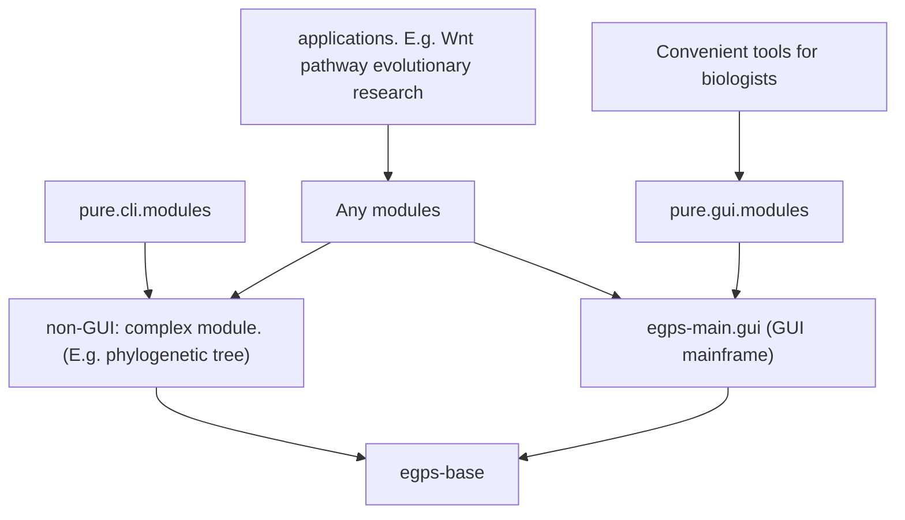

# egps-base

eGPS2 项目的核心基础设施。完整的类文档请参见 `docs` 子目录。

[English README](README.md)

如果您想要一个egps-base, egps-shell和egps-pathway.evol.browser 捆绑在一起的版本，请访问 https://github.com/yudalang3/eGPS2.1

## 关于本项目

完整文档请访问：https://www.yuque.com/u21499046/egpsdoc

类注释请参见 `/docs` 目录。


## 模块关系

从 eGPS 1.0 -> eGPS 2.0 -> eGPS 2.1，我们改变了技术架构。



这是 `egps-base` 项目。

注意：`egps-main.gui` 模块**未开源**，但可以免费使用。

上图是一个经典的模块依赖的有向无环图（DAG）：

1. 最顶层是一个依赖`eGPS2.1`的应用项目，例如一个演化生物学的研究项目
2. `egps-base`是一个最顶层无依赖的一些utils库
3. `egps-main.gui`就是整个eGPS框架，它有VOICE框架
4. `non-gui complex modules`就是非小工具类的大型模块
5. `Convenient tools for biologists`是一些对于科研工作者很好用的趁手工具


# 如何运行本项目

直接 `clone` 本仓库，然后导入 `IDEA`。

我们使用 `Java 25`。


## 如何部署

```bash
mvn dependency:copy-dependencies -DoutputDirectory=/Users/dalang/Documents/software/egps-collection/deployed
```

这样所有依赖的jar文件都会被导出。

```bash
mvn clean package source:jar
```

这样会打包已有的jar源代码，生成 `target/egps-base-${version}-sources.jar`和`target/egps-base-${version}.jar`


# 如何使用

## 在 macOS 上

### GUI 示例
```bash
java -cp "dependency-egps/*" gui.simple.tools.FilePathNormalizedGUI
```


### 命令行示例

查看所有可用的命令行工具：
```bash
java -cp "../dependency-egps/*" cli.tools.ListTools
# output
# Current available programs are:
#1	cli.tools.ClipboardPath4Win2WSL	Convert Windows file paths from clipboard to WSL format (e.g., C:\Users\... → /mnt/c/Users/...) and paste back to clipboard.
#2	cli.tools.ClipboardPathNormalized	Normalize file paths from clipboard by converting all backslashes to forward slashes for cross-platform compatibility.
#3	cli.tools.CountFilesWithSuffix	Count the number of files in a directory that match a specific file extension (non-recursive).
#4	cli.tools.ListFilesWithSuffix	List all files in a directory with a specified suffix and optionally export the filenames to a TSV file for batch processing.
#5	cli.tools.CheckNwkFormat	Validate whether a file contains phylogenetic trees in valid Newick (NWK) format by attempting to parse each line.
#6	cli.tools.RemoveInternalNodeNames	Remove internal node names from phylogenetic trees in Newick format while preserving leaf names, branch lengths, and tree topology.
#7	cli.tools.NodeNames4Space4Underline	Replace all spaces in phylogenetic tree node names with underscores to ensure compatibility with phylogenetic analysis tools.
#8	fasta.comparison.FastaComparer	Compare two FASTA files using BLAST/Diamond alignment results (fmt6 format) to calculate sequence match coverage ratios.
#9	fasta.comparison.PairwiseSeqDiffPrinter	Visualize pairwise sequence alignment differences with customizable marking modes, showing matches or mismatches and identity percentage.
#10	fasta.stat.UniqueStat	Analyze FASTA file for duplicate sequences, reporting frequency counts and calculating the repeat ratio for quality control.
#11	fasta.stat.BatchUniqueStat	Batch process multiple FASTA files for duplicate sequence analysis, generating statistics for all files in a directory.
#12	cli.tools.SeeModulesWeHave	Display a comprehensive list of all available eGPS modules that implement the IModuleSignature interface with their descriptions.
java -cp "../dependency-egps/*" cli.tools.SeeModulesWeHave
```

然后你就可以看到所有可用的模块。

# 具有有哪些功能？

这个基础模块，是作者博士六年，加上博后几年时间连续制作而成，里面有很多精华。但是无法全部都写出来。

因为我们已经将代码都开源了，欢迎各位直接看源代码，每个类都有注释。

Javadoc 我没有生成，因为 Javadoc 对于编写代码用户不是很大。而且我认为 Javadoc 对于开发人员来说，非常不友好。完整的类文档请参见 `docs` 子目录。