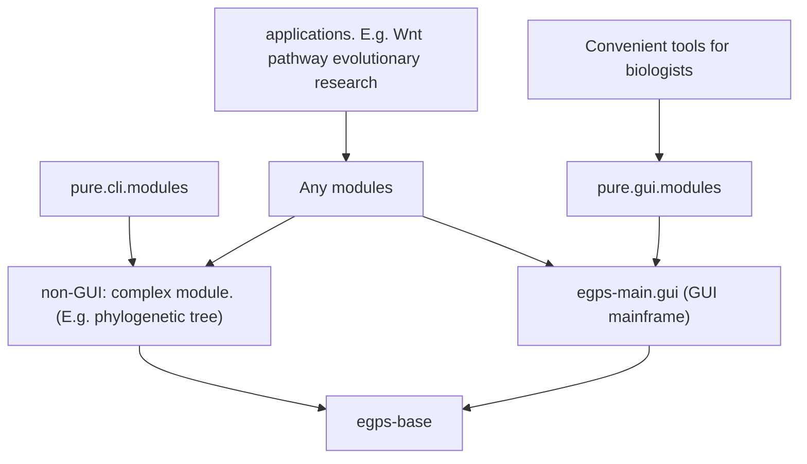

# egps-base

eGPS2 项目的核心基础设施。完整的类文档请参见 `docs` 子目录。


## 关于本项目

完整文档请访问：https://www.yuque.com/u21499046/egpsdoc

类注释请参见 `/docs` 目录。


## 模块关系

从 eGPS 1.0 -> eGPS 2.0 -> eGPS 2.1，我们改变了技术架构。



这是 `egps-base` 项目。

注意：`egps-main.gui` 模块**未开源**，但可以免费使用。

上图是一个经典的模块依赖的有向无环图（DAG）：

1. 最顶层是一个依赖`eGPS2.1`的应用项目，例如一个演化生物学的研究项目
2. `egps-base`是一个最顶层无依赖的一些utils库
3. `egps-main.gui`就是整个eGPS框架，它有VOICE框架
4. `non-gui complex modules`就是非小工具类的大型模块
5. `Convenient tools for biologists`是一些对于科研工作者很好用的趁手工具


# 如何运行本项目

直接 `clone` 本仓库，然后导入 `IDEA`。

我们使用 `Java 25`。


## 如何部署

```bash
mvn dependency:copy-dependencies -DoutputDirectory=/Users/dalang/Documents/software/egps-collection/deployed
```

这样所有依赖的jar文件都会被导出。

```bash
mvn clean package source:jar
```

这样会打包已有的jar源代码，生成 `target/egps-base-${version}-sources.jar`和`target/egps-base-${version}.jar`


# 如何使用

## 在 macOS 上

### GUI 示例
```bash
java -cp "dependency-egps/*" gui.simple.tools.FilePathNormalizedGUI
```


### 命令行示例

查看所有可用的命令行工具：
```bash
java -cp "../dependency-egps/*" cli.tools.ListTools
# output
# Current available programs are:
#1	cli.tools.ClipboardPathNormalized	Convert the file path C:\a\b\c.txt to /
#2	cli.tools.CountFilesWithSuffix	Count the files with certain suffix.
#3	cli.tools.ListFilesWithSuffix	List the names of files in a directory that end with a specified suffix and generate a TSV file.
#4	cli.tools.SeeModulesWeHave	Display all available modules that implement IModuleSignature interface.
#5	cli.tools.RemoveInternalNodeNames	Remove internal node names from phylogenetic trees in Newick format.
#6	cli.tools.NodeNames4Space4Underline	Replace spaces with underscores in phylogenetic tree node names.
#7	cli.tools.CheckNwkFormat	Validate whether a file is in valid Newick (NWK) format.
java -cp "../dependency-egps/*" cli.tools.SeeModulesWeHave
```

然后你就可以看到所有可用的模块。