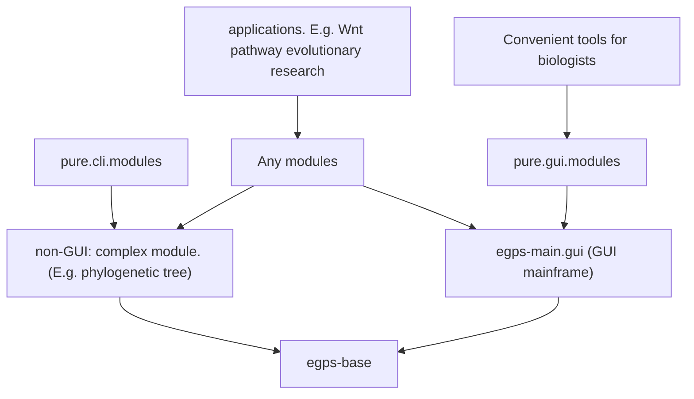

# egps-base

**eGPS-Base** 是一个面向演化基因组学与系统发育分析的综合性生物信息学工具库。它作为 eGPS 2.1 生态中的基础层，提供无下层依赖的核心基础设施。项目使用 Java 25 编写，并采用 Maven 进行构建管理。

eGPS2 项目的核心基础设施。完整的源代码`类`文档请参见 `docs` 子目录。

[English README](README.md)


## 关于本项目

完整文档请访问：https://www.yuque.com/u21499046/egpsdoc

完整的源代码`类`文档请参见 `docs` 子目录，此处为技术性总结。


## 从技术角度来看模块关系

从 eGPS 1.0 -> eGPS 2.0 -> eGPS 2.1，我们改变了技术架构。


```mermaid
graph TD
      mainframe --> egps-base;
      pure.cli.modules --> bigM[non-GUI: complex module. E.g. phylogenetic tree];
      any.modules --> mainframe["egps-main.gui (GUI mainframe)"];
      pure.gui.modules --> mainframe["egps-main.gui (GUI mainframe)"];
      application[applications. E.g. Wnt pathway evolutionary research] --> any.modules[Any modules];
		bigM --> egps-base;
            any.modules --> bigM["non-GUI: complex module. (E.g. phylogenetic tree)"];
            help.modules["Convenient tools for biologists"] --> pure.gui.modules

```

此处是底层的 `egps-base` 项目。

注意：`egps-main.gui` 模块**未开源**，但可以免费使用。

上图是一个经典的模块依赖有向无环图（DAG）：

1. 最顶层是一个依赖`eGPS2.1`的应用项目，例如一个演化生物学的研究项目（Wnt ppathway evolutionary research）
2. `egps-base`是一个最底层无依赖的一些utils功能的类似
3. `egps-main.gui`就是整个eGPS框架，它有VOICE框架
4. `non-gui complex modules`就是非小工具类的大型模块，主要是algorithms类
5. `Convenient tools for biologists`是一些对于科研工作者很好用的趁手工具，有图形界面


# 如何运行本项目

直接 `clone` 本仓库，然后导入 `IDEA`，本项目使用的是 `Java 25`。若你用VS Code，Eclipse等IDE，使用相应的方式导入即可。


## 如何部署

```bash
mvn dependency:copy-dependencies -DoutputDirectory=/Users/dalang/Documents/software/egps-collection/deployed
```

这样所有依赖的jar文件都会被导出。

```bash
mvn clean package source:jar
```

这样会打包已有的jar源代码，生成 `target/egps-base-${version}-sources.jar`和`target/egps-base-${version}.jar`


# 如何使用

在 macOS 上和Windows上，支持GUI和CLI两种方式使用：

### GUI 示例

直接启动软件即可，如果你需要所有模块都加载的软件，那么可以进入[通路进化浏览器](https://github.com/yudalang3/egps-pathway.evol.browser)，在Release下载即可。


### 命令行示例

查看所有可用的命令行工具：
```bash
java -cp "../dependency-egps/*" cli.tools.ListTools
# output
# Current available programs are:
#1	cli.tools.ClipboardPath4Win2WSL	Convert Windows file paths from clipboard to WSL format (e.g., C:\Users\... → /mnt/c/Users/...) and paste back to clipboard.
#2	cli.tools.ClipboardPathNormalized	Normalize file paths from clipboard by converting all backslashes to forward slashes for cross-platform compatibility.
#3	cli.tools.CountFilesWithSuffix	Count the number of files in a directory that match a specific file extension (non-recursive).
#4	cli.tools.ListFilesWithSuffix	List all files in a directory with a specified suffix and optionally export the filenames to a TSV file for batch processing.
#5	cli.tools.CheckNwkFormat	Validate whether a file contains phylogenetic trees in valid Newick (NWK) format by attempting to parse each line.
#6	cli.tools.RemoveInternalNodeNames	Remove internal node names from phylogenetic trees in Newick format while preserving leaf names, branch lengths, and tree topology.
#7	cli.tools.NodeNames4Space4Underline	Replace all spaces in phylogenetic tree node names with underscores to ensure compatibility with phylogenetic analysis tools.
#8	fasta.comparison.FastaComparer	Compare two FASTA files using BLAST/Diamond alignment results (fmt6 format) to calculate sequence match coverage ratios.
#9	fasta.comparison.PairwiseSeqDiffPrinter	Visualize pairwise sequence alignment differences with customizable marking modes, showing matches or mismatches and identity percentage.
#10	fasta.stat.UniqueStat	Analyze FASTA file for duplicate sequences, reporting frequency counts and calculating the repeat ratio for quality control.
#11	fasta.stat.BatchUniqueStat	Batch process multiple FASTA files for duplicate sequence analysis, generating statistics for all files in a directory.
#12	cli.tools.SeeModulesWeHave	Display a comprehensive list of all available eGPS modules that implement the IModuleSignature interface with their descriptions.
java -cp "../dependency-egps/*" cli.tools.SeeModulesWeHave
```

然后你就可以看到所有可用的模块。

# 具有有哪些功能？

这个基础模块，是作者博士六年，加上博后几年时间连续制作而成，里面有很多精华。但是无法全部都写出来。

因为我们已经将代码都开源了，欢迎各位直接看源代码，每个类都有注释。

这里没有单独生成 Javadoc 文档，因为相比之下，直接阅读源码和 `docs` 子目录中的类文档会更加直接。完整的类文档请参见 `docs` 子目录。
